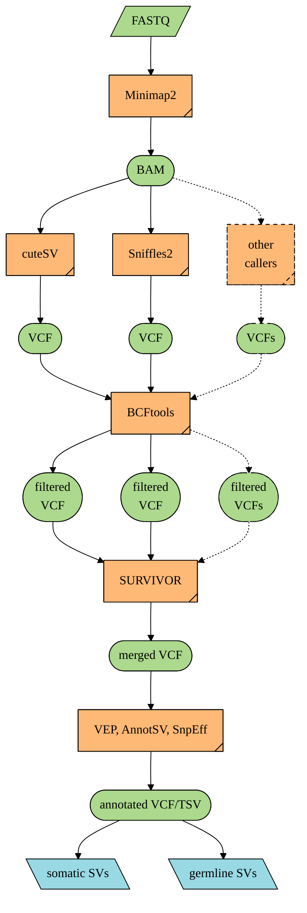

# A snakemake pipeline to call structural variants from tumor-only ONT data

> :warning: This pipeline is in its early stages. Please use with caution.

## Author

Minghao Jiang, <jiang01@icloud.com>

## Tools used

- SV callers

   [cuteSV](https://github.com/tjiangHIT/cuteSV), [Sniffles](https://github.com/fritzsedlazeck/Sniffles), [SVIM](https://github.com/eldariont/svim), [SVision](https://github.com/xjtu-omics/SVision), [Severus](https://github.com/KolmogorovLab/Severus), [NanoSV](https://github.com/mroosmalen/nanosv), [NanoVar](https://github.com/cytham/nanovar), [Delly](https://github.com/dellytools/delly), [Debreak](https://github.com/Maggi-Chen/DeBreak)

- Annotation tools

   [AnnotSV](https://github.com/lgmgeo/AnnotSV), [VEP](https://www.ensembl.org/info/docs/tools/vep/index.html) (release/111), [SnpEff](http://pcingola.github.io/SnpEff/snpeff/introduction/)

- R packages

   [vroom](https://www.tidyverse.org/tags/vroom/), [tibble](https://tibble.tidyverse.org/reference/tibble-package.html), [glue](https://glue.tidyverse.org), [dplyr](https://dplyr.tidyverse.org), [tidyr](https://tidyr.tidyverse.org), [purrr](https://purrr.tidyverse.org), [GenomicRanges](https://github.com/Bioconductor/GenomicRanges), [stringr](https://stringr.tidyverse.org), [BiocParallel](https://github.com/Bioconductor/BiocParallel), parallel

- Other tools

   [Minimap2](https://github.com/lh3/minimap2), [SAMtools](https://github.com/samtools/samtools), [BCFtools](http://samtools.github.io/bcftools/bcftools.html), [SURVIVOR](https://github.com/fritzsedlazeck/SURVIVOR), [vcf2maf](https://github.com/mskcc/vcf2maf) (1.6.21), [SnpSift](http://pcingola.github.io/SnpEff/snpsift/introduction/), [duphold](https://github.com/brentp/duphold)

## Pipeline structure



## Getting started

### Prerequisites

1. Clone this repo and navigate into it:

   ```shell
   git clone https://github.com/jasonwong-lab/smk_sv.git
   cd smk_sv
   ```

   - Follow all steps below after you are in the top dir of this repo.
   - Uncomment all rules in the `Snakefile`.
   - Check the predefined `wildcards_constraints` in the `Snakefile` and modify/delete it if necessary.
   - Using a JSON schema to validate the configuration file might prevent Snakemake from monitoring changes to the parameters. You can comment the `validate(config, "config/config.schema.json")` in the `Snakefile`.

2. Install [AnnotSV](https://github.com/lgmgeo/AnnotSV) manually.
   - AnnotSV is not included in the image due to its large annotation resources (~ 20GB) that cannot be specified elsewhere.
   - Creating a lock file for each combination of sample and type_sv has been implemented. However, AnnotSV might still encounter errors since it doesn’t support processing multiple files within the same directory. To address this, an additional resource parameter `constraint_annotsv=1` has been added to the rule `annotate_sv_annotsv` to ensure that only one instance of AnnotSV runs at a time. You can modify this parameter in `workflow/profile/default/config.yaml` where its default is `1`.

### Configuration

1. Prepare config files:
   1. Copy `config/config-test.yaml` to `config/config.yaml`.
      - Adjust the configuration settings according to your project's needs.
      - Specification of important elements:
         - `dir_run`: working directory where all results will be stored.
         - `mapper`: dict whose keys are names of mappers and values (boolean) indicate whether perform mapping or not. Only the first mapper will be used. When a mapper is specified and its value is `false`, no mapping by this mapper will be performed, but its results will be used in the following steps.
         - `callers`: dict whose keys are names of callers and values (boolean) indicate whether perform SV calling using this caller or not. When a caller is specified and its value is `false`, no SV calling by this caller will be performed, but its results will be used in the following steps.
         - `types_sv`: SV types to be called. BND indicates translocations.
         - `threads`: number of CPUs of each rule to be used.
         - ...
   2. Copy `workflow/profiles/default/config-test.yaml` to `workflow/profiles/default/config.yaml`.
      - Bind directories you need in the container.
      - Change the number of CPUs you prefer.
      - Modify/add/delete other parameters of this snakemake pipeline.

2. Prepare sample data:
   1. Copy `config/pep/samples-test.csv` to `config/pep/samples.csv`, and update `sample_name` in the csv.
   2. Copy `config/pep/config-test.yaml` and `config/pep/config.yaml`.
   More information please see [Portable Encapsulated Projects (PEP)](https://pep.databio.org).

3. Set up Conda environments:

   ```shell
   snakemake --conda-create-envs-only
   ```

### Execution

- Run the pipeline locally:

   ```shell
   snakemake
   ```

- Run the pipeline on a cluster:
   If you want to run this pipeline on a cluster (e.g., SLURM, or PBS), you should customise your own profile and place it into `~/.config/snakemake/`, and then run the pipeline with the profile you have set as a parameter:

   ```shell
   snakemake --profile <your_profile_name>
   ```

   Or run the pipeline with the profile you have set as an environment variable:

   ```shell
   export SNAKEMAKE_PROFILE=<your_profile_name>
   snakemake
   ```

   You can refer to the profile I have been using at `workflow/profiles/mycluster`, or turn to snakemake websites.

## Note for Cluster Users

If you are using a cluster that does not support Singularity well, please switch to the `without_docker` branch. This branch is tailored for environments where containers might not be the best option.

```shell
git checkout without_docker
```

## License

Codes here are licensed under the [GNU General Public License v3](http://www.gnu.org/licenses/gpl-3.0.html).
